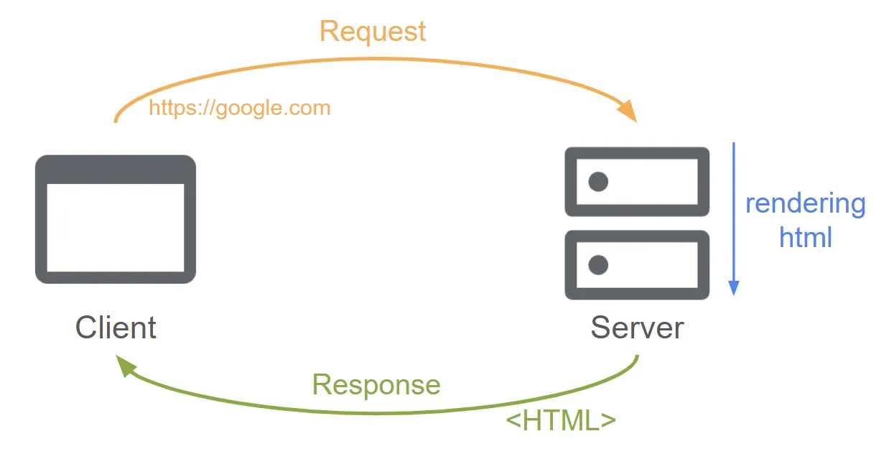
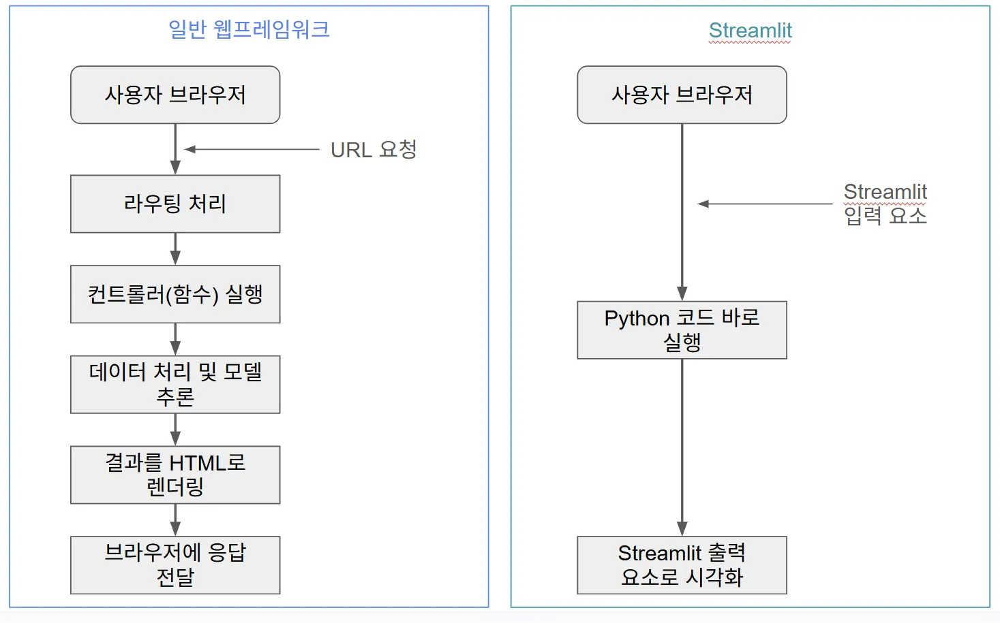

## 웹 애플리케이션이란?

- **웹 애플리케이션(Web App):** 웹 브라우저(Chrome, Edge 등)를 통해 동작하는 소프트웨어
    
    예: 구글 독스, 네이버 뉴스, 카카오톡 웹버전, Streamlit 대시보드 등
    
- **웹 APP 구조**
    
    - **사용자(Client):** 브라우저를 통해 서버에 요청(Request)을 보냄 (사용자의 작업)
    - **서버(Server):** 클라이언트로 부터 요청을 받아 처리 후, 결과(Response)를 돌려줌
		ex) 사용자(버튼 클릭) - 요청 - 서버(요청에 맞는 동작 수행) - 결과 반환

기본 구조

---

## 웹 프레임워크(Framework)란?

- **프레임워크**는 개발을 더 쉽고 빠르게 하기 위해 만들어진 소프트웨어 뼈대
    - 건물을 지을 때 철근 구조가 이미 갖춰져 있다면 나머지 부분만 채우면 빠르게 건축이 가능
    - 웹을 개발할 때도, 공통 기능(요청 처리, 라우팅, 세션 관리 등)을 매번 만들지 않고 뼈대로 만들어 개발의 효율성을 높힘
- **웹 프레임워크(Web Framework)의 역할**
	
	| 주요 기능                          | 설명                                   |
	| :------------------------------: | ------------------------------------ |
	| **라우팅(Routing)**               | 사용자가 입력한 URL을 분석해 어떤 기능(함수)을 실행할지 결정 |
	| **요청/응답 처리(Request/Response)** | 클라이언트 요청을 받고, 서버의 응답을 생성             |
	| **템플릿 관리(Template)**           | HTML, CSS, JS 등 화면 구조를 동적으로 생성       |
	| **데이터베이스 연동(ORM)**             | DB와 직접 쿼리 없이 객체 형태로 데이터를 다룸          |
	| **세션/인증 관리**                   | 로그인, 사용자 정보 저장 등 관리                  |
	| **API 개발 지원**                  | 다른 프로그램과 통신할 수 있도록 REST API 제공       |
	
## 대표적인 웹 프레임워크 예시

- 언어별로 다양한 웹 프레임 워크가 존재
    - 또한 동일 언어에서도 다양한 웹프레임워크가 존재하며 특징에 맞게 활용 가능

|언어|주요 프레임워크|특징|
|---|---|---|
|**Python**|Flask, Django, FastAPI, **Streamlit**|간단한 문법, 빠른 프로토타이핑|
|**JavaScript**|Express.js, Next.js, React, Vue|프론트엔드/백엔드 통합 생태계|
|**Java**|Spring Boot|대규모 엔터프라이즈 서비스에 강함|
|**PHP**|Laravel|간단한 웹 서버 구축에 적합|
|**Ruby**|Ruby on Rails|“CoC” 철학 (개발 과정에서 결정의 수를 줄임)|

1. Python
	- Flask: **경량(Lightweight)** 마이크로 프레임워크. 작고 간단한 API 서버나 소규모 프로젝트에 적합하며, 개발자가 필요한 기능을 직접 선택해 추가할 수 있어 유연성이 높습니다. 
	- Django: **풀스택(Full-stack)** 웹 프레임워크. 데이터베이스 연동, 관리자 페이지 등 웹 개발에 필요한 모든 기능을 기본으로 제공하여 **빠른 개발(Rapid Development)**에 강합니다. 
	- FastAPI: **고성능** 비동기 프레임워크. 파이썬의 타입 힌트(Type Hints)를 활용하여 자동으로 API 문서를 생성해주며, **최신 비동기 기술**을 사용해 빠른 속도를 자랑합니다. 
	- Streamlit: 데이터 과학자나 엔지니어가 **데이터 앱(Data App)**을 쉽게 만들 수 있도록 설계된 프레임워크. 간단한 파이썬 스크립트로 웹 UI를 빠르게 구축할 수 있습니다. 

2. JavaScript
	- Express.js: 가장 인기 있는 **백엔드(Backend)** 프레임워크. Node.js 위에서 동작하며, 최소한의 기능만 제공하여 미들웨어(Middleware)를 조합해 기능을 확장하는 방식입니다. 
	- Next.js: **React 기반**의 프론트엔드 프레임워크. 서버 렌더링(SSR), 정적 페이지 생성(SSG) 등 **SEO와 성능 최적화**에 필요한 기능을 제공하여 복잡한 웹 애플리케이션에 적합합니다. 
	- React: **UI 구축을 위한 라이브러리**. 컴포넌트(Component) 기반으로 사용자 인터페이스를 효율적으로 만듭니다. **싱글 페이지 애플리케이션(SPA)** 개발에 주로 사용됩니다. 
	- Vue: React와 유사한 **프론트엔드 라이브러리**. 배우기 쉽고 유연하며, React보다 상대적으로 진입 장벽이 낮아 빠르게 성장하고 있습니다. 

3. Java
	- Spring Boot: **Java 엔터프라이즈** 환경의 사실상 표준. 복잡한 설정 없이 애플리케이션을 빠르게 실행할 수 있게 하며, **대규모, 고성능, 안정성**이 요구되는 시스템 구축에 주로 사용됩니다. 

4. PHP
	- Laravel: 우아하고 표현력이 풍부한 문법을 가진 프레임워크. 간편한 **개발자 경험(DX)**을 강조하며, **간단한 웹 서버부터 복잡한 웹 애플리케이션**까지 다양한 규모에 사용됩니다. 

5. Ruby
	- Ruby on Rails: **"CoC(Convention over Configuration)"** 철학을 따릅니다. 관례를 따르면 설정 파일을 최소화하여 개발자가 결정할 부분을 줄여 **개발 속도를 매우 높여줍니다.** 

## Streamlit은 어떤 프레임워크인가?

- Streamlit은 데이터 사이언스 특화 웹 프레임워크로 간단하게 python 코드 만으로 웹 UI 요소를 만들고 활용 가능
- Python 언어를 통해 AI가 통합하거나 데이터를 시각화 해주는 대시보드형 웹 APP을 만들기에 적절함
- 반면, 다른 프레임워크처럼 일반적인 웹서비스를 배포하기에는 적절하지 않음

| 비교 항목  | 일반 웹 프레임워크 (Flask, Django) | Streamlit                             |
| ------ | -------------------------- | ------------------------------------- |
| 주요 목적  | 웹 서비스 개발 (전체 구조 포함)        | 데이터 시각화, ML/AI 모델 배포                  |
| 개발 난이도 | HTML/CSS/JS 이해 필요          | Python 코드만으로 UI 생성                    |
| 코드 구조  | 백엔드 + 프론트엔드 분리             | 단일 Python 스크립트                        |
| 사용자 입력 | form, AJAX 등 별도 처리         | `st.button`, `st.text_input` 등 간단한 위젯 |
| 배포 환경  | 웹 서버 설정 필요 (Gunicorn 등)    | Streamlit Cloud 등 간단 배포 지원            |

---

## 웹 프레임워크의 기본 구조 (요청 → 응답 흐름)

- Streamlit은 일반 웹 프레임워크의 요청 → 응답 과정을 매우 단순화 시킴

